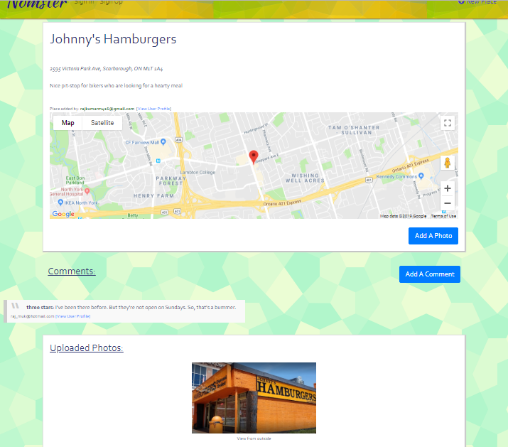

# Nomster

This is an app where food enthusiasts can post information about various restaurants and shops they have visited. Users can also upload photos and post comments (including ratings). A public dashboard is available for each user to showcase their involvement. 

The application was built on a Ruby on Rails framework. The information is saved to a PostgreSQL database. Devise is used for user authentication. The Geocoder API displays Google Maps when a correct street address is entered. SendGrid helps with notifying a user via email when someone else leaves a comment for the restaurant they have shared information on. 

## Click [here](https://nomster-rajkumar-mukerjee.herokuapp.com/) to visit the website!

This is the home page:

An example of a restaurant profile:

A sample user dashboard:

## Tools & Resources

* [Ruby on Rails](https://rubyonrails.org/) 
* [PostgreSQL](https://www.postgresql.org/)
* [Bootstrap](https://getbootstrap.com/)
* [Devise](https://github.com/plataformatec/devise/)
* [Geocoder](https://github.com/alexreisner/geocoder/)
* [Google Fonts](https://fonts.google.com/)
* [SendGrid](https://devcenter.heroku.com/articles/sendgrid/)

Enjoy your day!